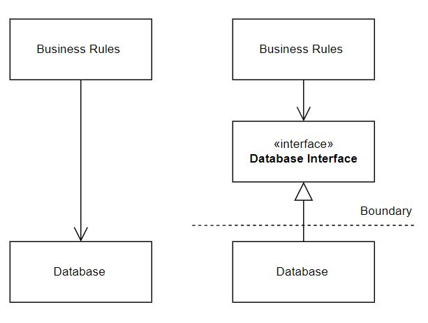
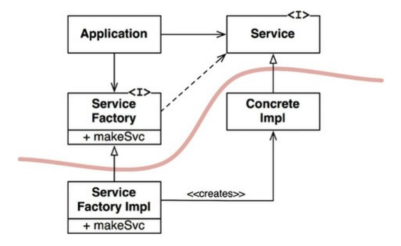

### *D* - Dependency Inversion Principle (*DIP*)

##### History

Introduced ny Robert C. Martin (aka. Uncle Bob)

> ***Nothing conrete should be depended on.***

The main goal of DIP is to decouple the source code and loosen the dependencies in order to make it less fragile.

##### Definition

* High-level modules should not depend on low-level modules. Both should depend on abstractions.
* Abstractions should not depend on details. Details should depend on abstractions.

> * ***Flexible systems are those in which source code dependencies refer only to abstractions.***
> * ***The flow of Control should be oposite of the flow of execution (and pointing inwards)***
  


##### IOC (Inversion Of Control) vs DI (Dependency Injection)
* Inversion of control is a design principle which helps to invert the control of object creation. 
* Dependency Injection is a design pattern which implements the IOC principle.
* IOC is used to achiebe DIP.

#### VOLATILITY

Imagine an interface and one or many implementor classes.

```C#
public interface IAbstraction {}
public class IConcretion : IAbstraction {}
public class ISecondConcretion : IAbstraction {}
```

###### Think about the following
* If we change the interface we need to change the class(es !!!!!).
* if we change the class we do not need change the interface.

The above means the the class (concretion) is more volatile than the interface (abstraction).
That means that if the code depends on an abstractions, it is more resilient to changes in the enviroment around it, than it would be if it depended in concretions.

###### We need to depend on concretions coming form the Framework !?!? 
In statically typed languages like C#/Java the `use, import, include` statements should 
refer to only to source modules containing interfaces, abstract classes or some other kind 
of abstract declaration. 
In dynamic typed languages, like Ruby or Python, it is a bit harder to argue what a concrete module is.

Software systems must depend on many concrete modules. In C#, a prime example is the `System`. It would 
be unrealistic to try to abstract away the `DateTime` class. Though if you think about it, `DateTime`
is very stable (Non Volatile). There are rare changes in that class and when there are, they are not severe.

##### Factories
There are cases where we can't avoid the creation/instanciation of volatile concrete classes.
In order to keep the system resilient to changes in thoses classes we can use abstract factories.



##### Plugin Architecture - (Discuss)

what depends on what ?
* Game Boy console - Game Boy game
* Chat(Teams, Slack, Telegram...) - Chat Bot
* PC - Printer (Assume usb connection)
* Motherboard - GPU (PCI) / HDD (SATA)
* Send notification - Email/Sms/MessageBus(Kafka, RabbitMQ, ServiceBus)
* Surface Data application - NavData Api Client

The plugin architecture is based on the same principle and it existed long before OO languages came into existence.
In C (Not OO) there is the standard input/output. But when we call `printf()` in the source code we are unaware of underlying device 
(screen/printer/...) at that time.

##### Some Rules

* *Don' t refer to volatile concrete classes.*
  * Concrete classes are volatile by definition
* *Don' t derive from volatile concrete classes.*
  * Use inheritance with great care. It is the strongest of all source code relationships. 
    * Composition over Inheritance (Prefer `has a` over `is a`)
    * With great power comes great responsibility
* *Don' t override concrete functions.*
  * Functions are concretions. They require source code dependencies and they will be inherited.
  * Make the functions abstract and create multiple implementations. 
* *Never mention the name of anything concrete and volatile.*
  * This is really just a re-statement :)

##### Final statement

The most importand things in any program is the domain and bussiness logic.
The domain is a description of the real world, modeled(using classes/objects) inside our program.
The bussiness logic is the collection of Use Cases and the Rules that apply on these models.

> * Model: Airport
> * Use Case: Create Airport
> * Rule: Duplicate Icao Codes are not allowed.

***THE REST ARE "DETAILS"***
* Which db we will use
* Which ORM we choose
* How the results will be presented to the user
* Will we use a REST API or a CLI
* Will we export in text(plz no) or in XML/JSON?
* Even the .Net framework can be considered a detail

> *We should protect what matters: the Bussiness Logic, 
from all the volatility of the surrounding environment*

#### Examples...
